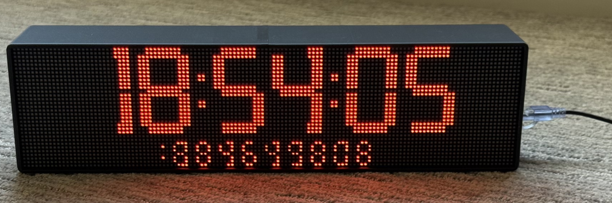
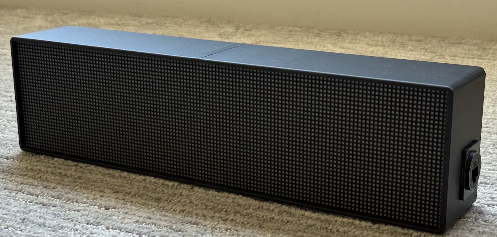
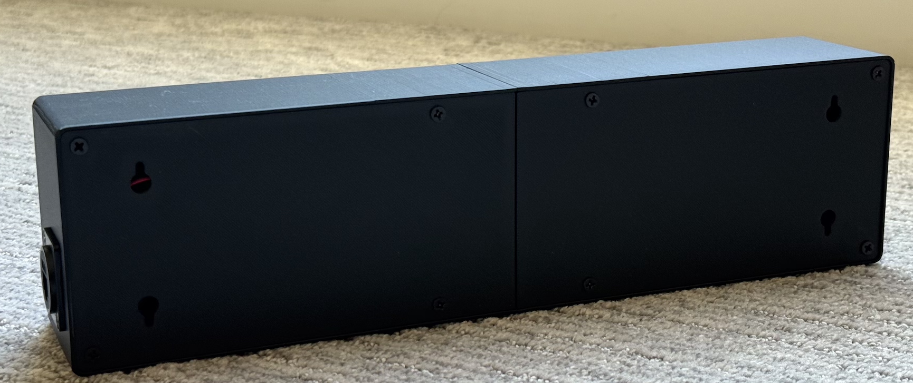
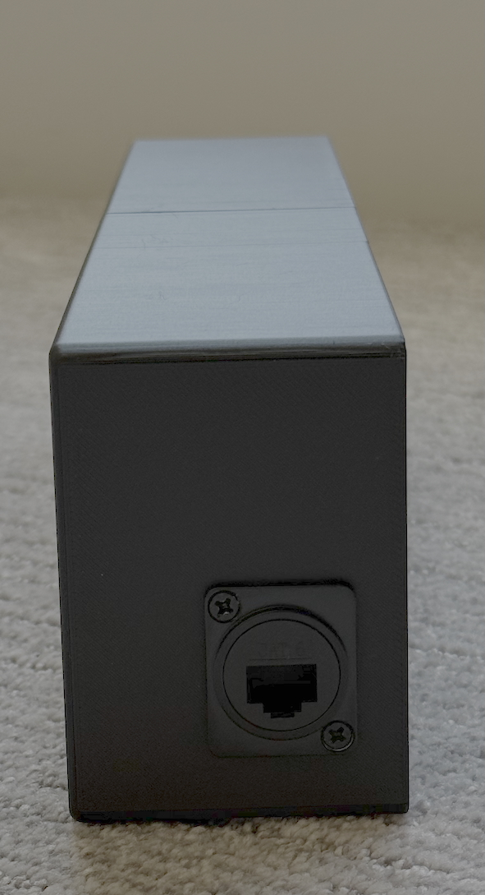
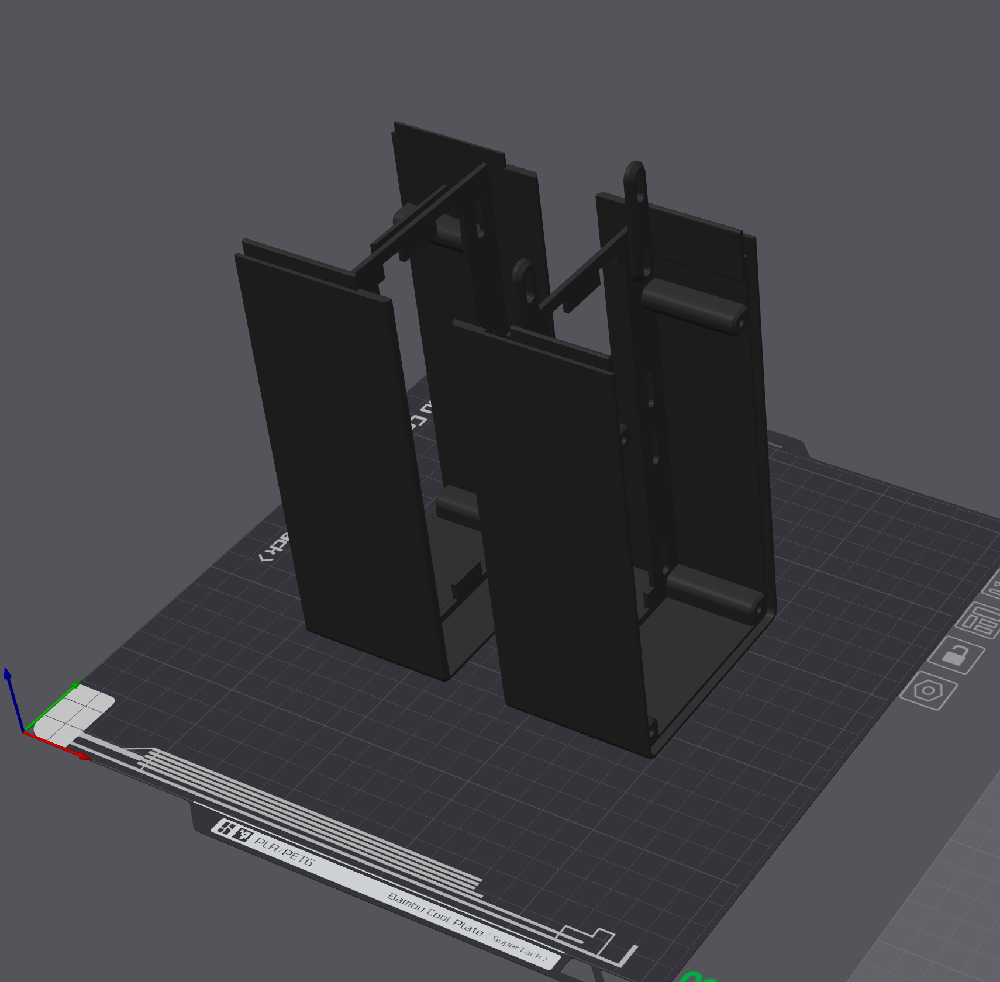
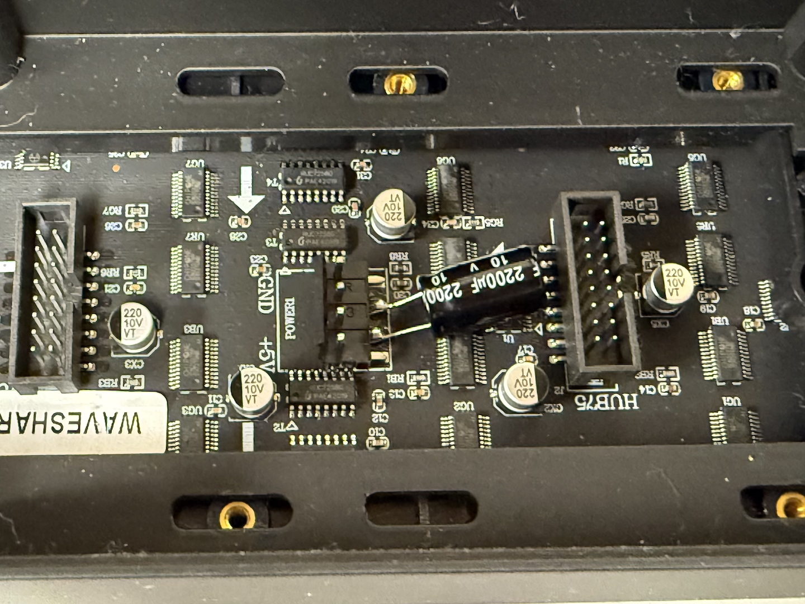
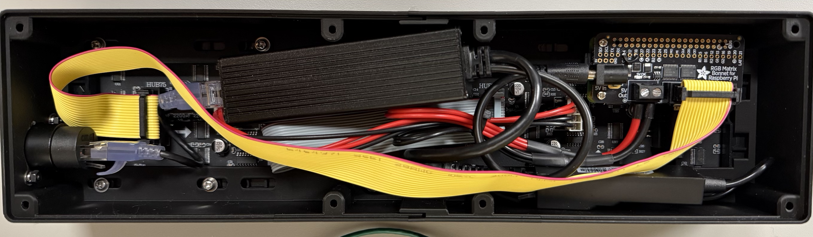

# PTPi Clock

A **PTP (IEEE-1588) synchronized LED clock** designed for Raspberry Pi and RGB LED matrix panels. The clock listens directly to **PTP packets** and displays the time.



A spiritual successor of Oliver Ettlin's wall clock https://github.com/Gemini2350/ptp-wallclock

* Supports **PTP v2**
* **PTP multicast**
* Works with **1-step and 2-step clocks**
* **Follow_Up timestamps**
* Supports **software RX timestamping** via `SO_TIMESTAMPNS`
* Converts **TAI → UTC**
* Stops the clock display if PTP packets stop arriving

Wouldn't it be better to synchronize the system clock with PTP, then just read it and display it on the screen? For a clock, yes, that would be much better, but that is not the intention of this project; the intention is to read the RAW PTP packets and use that to display the time. The intention of this clock is to provide a quick way to troubleshoot and visualize raw PTP.

Don't be like me and troubleshoot for hours only to realize your boundary clock is using a source IP of 0.0.0.0. If you don't know, most versions of the Linux Kernel will drop traffic with a source of 0.0.0.0 before it gets to the socket. There are kernel tweaks you can do to get around that, but the best practice is to have PTP packets with a proper source IP.

*Disclaimer* 

Parts of this code were either vibe-coded or refactored using LLMs. 

---

# Hardware

| Component                           | Link                                                         |
| ----------------------------------- | ------------------------------------------------------------ |
| Raspberry Pi Zero / Raspberry Pi    |                                                              |
| 2x RGB LED Matrix panels 64x32 P2.5 | https://www.waveshare.com/rgb-matrix-p2.5-64x32.htm          |
| Adafruit Matrix Bonnet              | https://www.adafruit.com/product/3211                        |
| 5V 5A POE Splitter                  | https://www.amazon.com/dp/B0D7L1NVQS                         |
| NIC Hat or OTG NIC                  | https://www.waveshare.com/wiki/ETH/USB_HUB_HAT_(B)<br />https://www.amazon.com/dp/B01AT4C3KQ |

---

# Display Layout

I have 3 different cpp files for different ways to display the time. I did this because I couldn't decide which one I liked the best. Eventually, I'd like it to be a single file with a command-line option to select.

#### ptpi-clock.cpp


#### ptpi-clock_2line.cpp


#### ptpi-clock_7seg.cpp


`ptpi-clock.cpp` and `ptpi-clock-2line.cpp` use `bdf` fonts, so you can swap them out to whatever looks best for you. Beware that some of the digit placements are hardcoded based on those fonts. `ptpi-clock-7seg.cpp` digit are all generated, but does use `7x14B.bdf` font for error messages. 

---

# Installation

First clone this repository:

```
git clone https://github.com/jonathansm/ptpi-clock
cd PTPi-Clock
```

## LED-matrix library and setting up the Pi to use the Adafruit Bonnet. 

Easiest thing is to use the Adafruit install script. It will walk you through the installation process. Do this inside the project directory.

```
wget https://raw.githubusercontent.com/adafruit/Raspberry-Pi-Installer-Scripts/main/rgb-matrix.sh
sudo bash rgb-matrix.sh
```

When it asks you if you want "**quality**" or "**convenience**", select "**quality**," but keep in mind this requires soldering a bodge between GPIO4 and GPIO18 and disables sound from the Pi. You can do the bodge right on the bonnet. Not sure if this is required, as I didn’t try the "**convenience**" option, but from what I’ve read, it's best to go with "**quality**".

When it asks you to reboot, select no. We have one more thing we need to do before rebooting.

Add `isolcpus=3` to the end of line in `/boot/firmware/cmdline.txt`. Save, then reboot.


---
## Build

From the project directory edit the Makefile to select which display you want, change the`.cpp` file to which ever one you want and then save the file.

 Compile the code:

```
make
```

Or manually:

```
g++ -std=c++17 -O2 <display_version>.cpp -o ptpi-clock \
  -Irpi-rgb-led-matrix/include \
  -Lrpi-rgb-led-matrix/lib \
  -lrgbmatrix -lrt -lpthread
```

---

## Move Files

Copy the binary and fonts:

```
sudo mkdir -p /opt/ptpi-clock/fonts
sudo cp ptpi-clock /opt/ptpi-clock/
```

If using `ptpi-clock_2line.cpp`

```
sudo cp rpi-rgb-led-matrix/fonts/10x20.bdf /opt/ptpi-clock/fonts/
sudo cp rpi-rgb-led-matrix/fonts/5x8.bdf /opt/ptpi-clock/fonts/
```

If using `ptpi-clock.cpp` or `ptpi-clock_7seg.cpp`

`sudo cp rpi-rgb-led-matrix/fonts/7x14B.bdf /opt/ptpi-clock/fonts/`


---

## Running Manually

Basic run:

```
sudo /opt/ptpi-clock/ptpi-clock -i eth0
```

---

## Options

| Option | Description            |
| ------ | ---------------------- |
| `-i`   | Network interface      |
| `-r`   | Red value (0-255)      |
| `-g`   | Green value (0-255)    |
| `-b`   | Blue value (0-255)     |
| `-tz`  | Timezone offset        |
| `-log` | Enable console logging |

---

### Examples

Default:

```
sudo ptpi-clock -i eth0
```

Green clock:

```
sudo ptpi-clock -i eth0 -r 0 -g 255 -b 0
```

Mountain Time:

```
sudo ptpi-clock -i eth0 -tz -7
```

Enable debug logging:

```
sudo ptpi-clock -i eth0 -log
```

---

## Running as a Service

Edit the service file with any options that you want to include, then move the service file:

```
sudo cp ptpi-clock.service /etc/systemd/system/ptpi-clock.service
```

Enable service:

```
sudo systemctl daemon-reload
sudo systemctl enable ptpi-clock
sudo systemctl start ptpi-clock
```

## Delete Project Folder

You can delete the project folder now if you would like to.

```
cd ../
rm -rf PTPi-Clock/
```

## Read Only File System

This is not required, but if you plan to shut down the Pi by just killing power rather than gracefully, doing this will help prevent corruption of the SD Card. 

You can follow a guide such as this one to put the file system into read only

https://learn.adafruit.com/read-only-raspberry-pi/overview

---

# Case

The case is based on this model https://www.printables.com/model/1535209-enclosure-for-128x32-p25-rgb-led-matrix-panel/files modified to increase the back by 10mm, this allowed everything to fit. Also removed the holes in the back plate since I drilled a hole on the side and used a panel mount connector.







## Print settings

PLA
15% infill
.20mm or .16mm layer height
Nothing too crazy, mostly left things as default. 

I found that it was best to print in this orientation, using tree supports.



# Power

The most common advice when researching projects with these panels is to ensure a stable, reliable power supply. I conducted multiple tests and observed that the peak power draw using a Raspberry Pi Zero 2W, the 7seg display, and LEDs set to white at maximum brightness is approximately 900mA. This number may fluctuate depending on the exact Raspberry Pi model.

Given these results, I am confident using the PoE splitter listed above to power the setup. The splitter is specified for up to 5 amps, though this may not be accurate. The switch identifies as a class 4 POE device, so based on that it should supply close to 5amps. 

I have operated the clock continuously (24/7) since assembly without experiencing stability issues. Notably, the display only flickers or dims when brightness is set below maximum, but that could be because of current spikes caused by PWM.

You can add a 10V 2200 µF capacitor on each panel to help absorb spikes. But this is completely optional.



After adding the capacitors I did seem to notice an improvement, it wasn't perfect but much better than without. I'm sure there are some other software tweaks that may help, but for now, I just run it at max brightness. Who doesn't want to see the clock from the other side of the house?!

# Assembly

This isn’t meant to be a detailed step-by-step assembly guide; it’s pretty straightforward. A picture is worth a thousand words.



You’ll need a variety of 3mm screws and standoffs. I drilled a hole in the side for a CAT6 panel-mount connector so that when it’s unplugged, there aren’t any loose cables hanging out. The Raspberry Pi Zero is mounted using a 3mm standoff secured to the panel. Right now, it’s only fastened at one corner, so it has a bit of movement, but that hasn’t caused any issues so far.

I originally planned to use the Waveshare Ethernet HAT, but once everything was stacked together, it made the build too tall to fit in the case. I wanted to keep the width consistent with my NTP clocks, so I switched to a USB OTG Ethernet adapter instead. It works great and actually draws less power than the HAT. Because I mounted the Pi where I did, I needed a longer HUB75 (2x8p ribbon) cable, I went with a 40mm cable, which fit perfectly.

For attaching the back panel, you can use 3mm countersunk screws directly into the plastic. In the future, I may upgrade this to threaded inserts for a more durable solution.

As for the internal layout, I fit everything into the case while ensuring the PoE splitter's metal housing wasn’t pressed directly against the panels. It’s not the cleanest setup, but everything fits snugly, and nothing shifts when the clock is moved. Down the line, it would be nice to design a more refined mounting system, but for now, this works just fine.

#  Todo

1. Combine all clock faces into a single program and use a command-line argument to select display mode.
2. Break out PTP processing code into separate library
3. Hardware Timestamping support for NICs that support it.
4. 12-hour format, with AM/PM indicator.
5. Test that the 1-step actually works. I don't have a 1-step master clock, so I'm not 100% sure that it works.
6. Port to a microcontroller. This would greatly improve boot time and remove the overhead of a full Linux system.
7. Auto TIA to UTC offset, if in PTP packet

# Testing

This has been tested so far only in my environment, which consists of the PTPi Clock connecting to a PTP-aware switch operating as a 2-step boundary clock downstream of my PTP Master. This means the switch sends PTP packets regardless of IGMP group memberships. The PTPi Clock does send an IGMP Join request for the multicast group of 224.0.1.129. I have not verified that this works in a purely multicast-only PTP network. In theory, it should work. 

# License

Add GNU General Public License version 2
